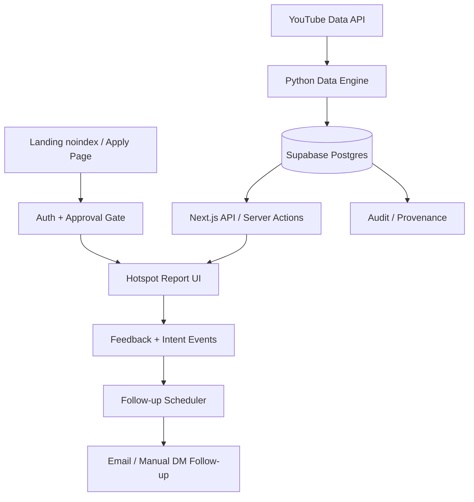
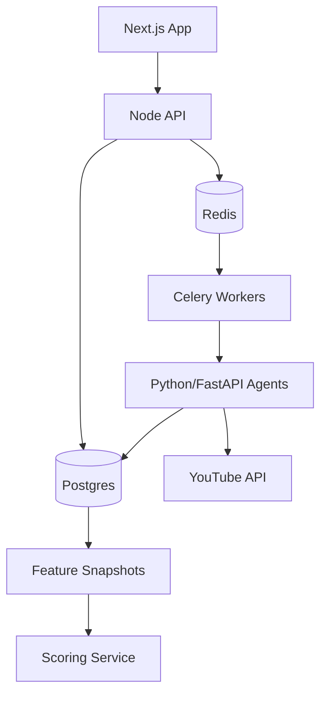

# 02 · NOXUND Stack & Infra Architecture

**Objetivo:** definir a stack técnica do MVP sem antecipar custo de marketplace.

---

## 1. Princípio de arquitetura

A arquitetura do MVP deve ser forte o suficiente para defender a credibilidade do relatório, mas simples o bastante para validar rápido.

A NOXUND não deve construir infraestrutura de marketplace antes de provar que o Hotspot Artists muda decisão de produção.

---

## 2. Arquitetura geral

---

## 3. Stack aprovada para MVP

| Camada | Escolha | Motivo |
|---|---|---|
| Frontend | Next.js + TypeScript | Velocidade, integração com Vercel, rotas protegidas, bom DX. |
| UI | Tailwind CSS + componentes próprios/shadcn | Permite visual premium sem custo alto. |
| Core API | Next.js Route Handlers / Server Actions | Suficiente para MVP fechado; evita serviço Node separado cedo demais. |
| Auth | Supabase Auth | Reduz número de fornecedores porque o banco já será Supabase. Clerk pode ser reavaliado antes do marketplace. |
| Banco | PostgreSQL via Supabase | Fonte de verdade relacional para produtores, relatórios, eventos e auditoria. |
| Data Engine | Python | Melhor para coleta, parsing, cálculo, normalização e futura IA. |
| API interna de dados | FastAPI opcional | Útil quando o engine virar serviço. Para a primeira validação, script/worker Python basta. |
| Email | Resend ou Postmark | Follow-up transacional confiável. |
| Cron | Vercel Cron ou Supabase Scheduled Functions | Checar follow-ups pendentes diariamente. |
| Analytics | Eventos próprios no Postgres + PostHog opcional | Métricas de validação precisam ser auditáveis no banco. |
| Observabilidade | Sentry | Erros de app e engine. Datadog só em Fase 2/3. |
| Cache | CDN/Next cache; Redis adiado | Dois relatórios estáticos não justificam Redis obrigatório. |
| Filas | Adiar Celery/Redis | Celery entra quando o pipeline for recorrente/sob demanda. |
| Deploy | Vercel + ambiente Python separado ou job manual | Vercel para produto; Python pode rodar como job controlado no MVP. |

---

## 4. Decisão crítica: Redis e Celery

### Recomendação do Product Lead
Não tornar Redis/Celery bloqueadores do MVP.

### Por quê
O MVP não executa geração sob demanda para cada usuário. Ele entrega dois snapshots fixos. Para coletar 500 vídeos e montar 2 relatórios, um job Python controlado é suficiente.

### Quando entram
Redis + Celery entram quando:

- houver multi-keyword;
- houver múltiplos subgêneros;
- houver geração sob demanda;
- jobs demorarem o suficiente para bloquear execução;
- houver necessidade de retry automático e filas paralelas.

---

## 5. Ambientes

### Local
- Next.js app.
- Supabase local ou projeto dev remoto.
- Python scripts com `.env` local.
- Dados fake para desenvolvimento de UI.

### Staging
- Vercel preview.
- Supabase staging.
- YouTube API key com quota controlada.
- Lista interna de testes.

### Production Beta
- Vercel production.
- Supabase production.
- Sentry production.
- Email domain autenticado.
- Acesso fechado por aprovação.

---

## 6. Serviços externos

### YouTube Data API v3
Usada para:

- buscar vídeos por keyword;
- coletar estatísticas;
- coletar dados de canal;
- montar snapshots brutos.

Requisitos:

- rate limiting rígido;
- guardar payload bruto;
- logar quota usada;
- nunca recalcular relatório sem associar `run_id`.

### Email provider
Usado para:

- confirmação de aprovação;
- envio de link de acesso;
- follow-up 10–14 dias após intenção;
- pergunta de WTP.

### Instagram DM
No MVP, DM deve ser manual ou semi-manual. Não depender de automação oficial do Instagram.

---

## 7. API surface do MVP

### Public / semi-public
- `GET /` — landing/apply page noindex.
- `POST /apply` — cria aplicação.

### Authenticated producer
- `GET /app/report` — relatório fechado.
- `POST /api/report/:reportId/artist/:artistId/feedback` — útil/não útil.
- `POST /api/report/:reportId/artist/:artistId/intent` — vou produzir.
- `POST /api/wtp` — resposta de disposição a pagar.

### Admin
- `GET /admin/applications`
- `PATCH /admin/applications/:id/status`
- `GET /admin/reports`
- `POST /admin/reports/:id/publish`
- `GET /admin/metrics`

### Internal jobs
- `POST /internal/followups/run-due`
- `POST /internal/youtube/run-collection` — opcional, protegido, pode ser substituído por CLI no MVP.

---

## 8. Infra de dados

### Raw é sagrado
Tudo que vem da YouTube Data API deve ser salvo como snapshot bruto, imutável.

### Computed é reconstruível
Score, Velocity, Signals, Competition e report rows podem ser recalculados a partir do raw.

### Report snapshot é congelado
O relatório visto pelo produtor não muda depois de publicado, mesmo que novos dados apareçam.

---

## 9. Segurança e acesso

Requisitos mínimos:

- Todas as rotas `/app` exigem autenticação.
- Usuário autenticado precisa estar aprovado.
- Admin separado por role.
- Row Level Security no Supabase.
- API key da YouTube nunca exposta no frontend.
- Webhook/cron interno protegido por secret.
- Logs sem tokens, API keys ou dados sensíveis.

---

## 10. Observabilidade

### Eventos de produto obrigatórios
- aplicação enviada;
- aplicação aprovada/rejeitada;
- relatório aberto;
- troca de relatório;
- clique no Example;
- feedback útil/não útil;
- intenção declarada;
- follow-up enviado;
- follow-up respondido;
- WTP respondido.

### Erros técnicos obrigatórios
- falha na YouTube API;
- quota próxima do limite;
- vídeo sem estatística;
- falha de parsing de artista;
- falha de envio de email;
- tentativa de acesso sem aprovação.

---

## 11. O que NÃO entra na infra do MVP

- S3/R2 para arquivos de beats.
- CDN para previews de áudio.
- processamento de áudio.
- Stripe/Stripe Connect.
- antifraude transacional.
- sistema de licenças.
- storage privado pós-compra.
- busca de marketplace.
- Elasticsearch/Meilisearch.
- Rust services.
- microservices reais.
- data lake diário.

Esses itens pertencem à futura camada de marketplace.

---

## 12. Arquitetura de Fase 2

Quando a validação passar, evoluir para:

Fase 2 pode adicionar:

- Celery;
- Redis;
- FastAPI persistente;
- multi-keyword;
- query real 1/dia;
- reports semanais;
- plano pago beta;
- data lake seletivo.

