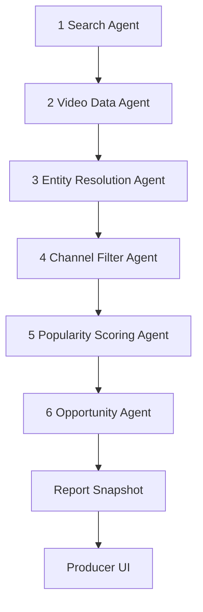

# 03 · Data, AI Agents & Methodology

**Objetivo:** definir como o Hotspot Artists Report é produzido, auditado e protegido contra arbitrariedade.

---

## 1. Princípio diretor

> IA generativa nunca produz, julga ou exibe número.

Todo valor exibido ao produtor precisa ser uma função determinística de dados brutos da YouTube Data API.

Isso vale para:

- Score;
- Velocity;
- Signals;
- Competition;
- HOT;
- Example;
- ranking.

---

## 2. Pipeline do MVP

### Modo MVP
- Agentes 1–2: automatizados.
- Agente 3: regex + assistência de IA em casos ambíguos + revisão humana.
- Agentes 4–6: código determinístico + revisão humana apenas para casos de borda.

O humano pode revisar evidência, remover spam óbvio e corrigir parsing. O humano não pode “ajustar Score no olho”.

---

## 3. Agente 1 — Search Agent

### Função
Buscar vídeos no YouTube com a keyword travada.

### Entrada
- `keyword = chicago drill type beat`
- `publishedAfter = now - 30 days`
- alvo: aproximadamente 500 vídeos

### Saída
Lista de vídeos com:

- `video_id`
- `title`
- `channel_id`
- `published_at`

### Auditoria
Salvar:

- query exata;
- data/hora da coleta;
- janela temporal;
- page tokens usados;
- total coletado;
- resposta bruta da API.

---

## 4. Agente 2 — Video Data Agent

### Função
Coletar estatísticas dos vídeos.

### Entrada
`video_id[]`

### Saída
Por vídeo:

- views;
- likes;
- comentários;
- título;
- canal;
- data de publicação;
- thumbnails;
- URL.

### Regra
O payload bruto não pode ser sobrescrito.

---

## 5. Agente 3 — Entity Resolution Agent

### Função
Extrair o nome do artista do título do vídeo.

### Regra principal
A primeira tentativa deve ser regex/padrão:

`<artist> type beat`

### IA generativa
Pode ser usada somente quando o título for ambíguo.

### Guardrails
- A saída precisa ser substring ou normalização plausível do título.
- Se o nome não estiver sustentado pelo título, rejeitar.
- Casos ambíguos entram em revisão humana.
- Não existe coluna pública de confidence no relatório.
- Qualquer score interno de parsing é metadado operacional, não produto.

### Auditoria
Salvar:

- título original;
- nome extraído;
- método: regex, IA assistida ou humano;
- motivo de revisão;
- override humano, se houver.

---

## 6. Agente 4 — Channel Filter Agent

### Função
Remover canais inelegíveis e medir saturação por canais distintos.

### Critérios iniciais de elegibilidade
Um canal é elegível se:

- tem histórico mínimo de uploads públicos;
- não parece spam/duplicação em massa;
- possui sinais consistentes de canal real;
- o vídeo está alinhado ao padrão de type beat.

### Saída
- flag de elegibilidade por canal;
- lista de canais válidos por artista;
- contagem de canais distintos por artista.

### Observação
Canais distintos alimentam Competition. Vídeos válidos alimentam Signals. Esses conceitos não podem ser duplicados.

---

## 7. Agente 5 — Popularity Scoring Agent

### Função
Calcular Score e componentes.

### Componentes

| Componente | Peso | Cálculo conceitual |
|---|---:|---|
| Velocity normalizada | 40% | views/dia do artista relativo à amostra |
| Signals | 25% | quantidade de vídeos válidos, com penalização de excesso |
| Engajamento ponderado por recência | 20% | taxa de engajamento com peso maior para vídeos recentes |
| Diversidade de canais | 15% | múltiplos canais distintos validando a demanda |

### Requisitos
- Fórmula versionada.
- Hash do rubric salvo.
- Mesmo input precisa gerar mesmo output.
- Score não pode ser editado manualmente.

---

## 8. Agente 6 — Opportunity Agent

### Função
Gerar ranking e linhas do relatório.

### Regras

#### HOT
`HOT = true` se `Score > 90`.

#### Score exibido
Score aparece apenas se `Score > 83`.

#### Competition
| Nível | Critério |
|---|---|
| Low | ≤ 5 canais distintos |
| Medium | 6–15 canais distintos |
| High | > 15 canais distintos ou crescimento de publicações nos últimos 7 dias > 50% vs 7 dias anteriores |

#### Example
Regra determinística:

1. vídeos elegíveis do artista;
2. ordenar por velocity;
3. pegar top 3;
4. escolher o mais recente;
5. em empate, escolher maior views absoluto.

---

## 9. Estrutura do relatório

Cada linha deve ter:

- `title`
- `tag`
- `score`
- `signals`
- `velocity`
- `competition`
- `example_url`
- `example_video_id`
- `report_id`
- `run_id`
- `rubric_version`

---

## 10. Auditoria por célula

### Score
Precisa rastrear:

- componentes;
- pesos;
- vídeos usados;
- normalização;
- rubric_version;
- run_id.

### Velocity
Precisa rastrear:

- vídeos considerados;
- views;
- dias desde publicação;
- mediana final.

### Signals
Precisa rastrear:

- vídeos válidos;
- vídeos rejeitados;
- motivo de rejeição.

### Competition
Precisa rastrear:

- canais distintos;
- lista de channel_id;
- nível final.

### Example
Precisa rastrear:

- vídeos candidatos;
- top 3 por velocity;
- regra de desempate;
- vídeo escolhido.

---

## 11. Raw vs computed

### Raw
Dados brutos da API:

- video payload;
- channel payload;
- search response;
- timestamp.

Raw é imutável.

### Computed
Dados derivados:

- artist mapping;
- channel eligibility;
- metrics;
- score;
- competition;
- report rows.

Computed é reconstruível.

---

## 12. Reprodutibilidade

O teste obrigatório:

> Rodar o pipeline novamente sobre o mesmo snapshot bruto e o mesmo rubric deve gerar exatamente o mesmo relatório.

Se não gerar, existe bug metodológico.

---

## 13. Data lake — decisão

Não construir coleta diária contínua no MVP.

### Permitido
- snapshots por rodada de coleta;
- reprocessamento de snapshot;
- armazenamento bruto dos 500 vídeos coletados.

### Não permitido no MVP
- rastrear diariamente todos os artistas;
- análise histórica longa;
- trendline multi-mês;
- data lake de artistas que falharam no filtro, exceto se já estiverem no snapshot bruto da rodada.

---

## 14. Exposure penalty — decisão

Não implementar no MVP.

### Motivo
O MVP tem dois relatórios fixos. Exposure penalty só faz sentido quando existir feed recorrente, personalização ou múltiplas rodadas.

### Condição futura
Entrará somente com:

- fórmula documentada;
- versão;
- auditoria;
- separação clara entre saturação de mercado e saturação de interface.

---

## 15. ML scoring — decisão

Não implementar no MVP.

### Futuro permitido
ML pode gerar raw_score apenas se houver:

- volume suficiente de producer_outcomes;
- versionamento de modelo;
- snapshot de features;
- dataset de treino versionado;
- explicabilidade mínima;
- comparação contra rubric determinístico.

---

## 16. Casos de revisão humana

Enviar para revisão humana quando:

- artista extraído for ambíguo;
- título contiver múltiplos artistas;
- canal parecer spam mas não houver regra clara;
- vídeo for ofensivo ou prejudicar credibilidade do Example;
- canal tiver padrão artificial de upload;
- métrica for outlier extremo.

Revisão humana precisa registrar motivo. Não pode editar número sem reprocessar.

---

## 17. Promessa metodológica pública

O produto pode comunicar:

> “Os rankings são baseados em sinais recentes observados em vídeos públicos do YouTube dentro da janela analisada.”

Não comunicar:

> “Nossa IA encontrou os artistas que vão viralizar.”

