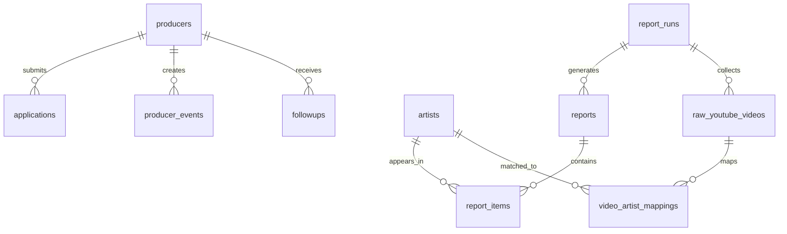

# 04 · Database & Event Model

**Objetivo:** definir o modelo de dados mínimo para o MVP, mantendo auditoria, reprodutibilidade e métricas de validação.

---

## 1. Princípios

1. Raw é imutável.
2. Computed é reconstruível.
3. Eventos de produtor são log, não flags mutáveis.
4. Rubrics e pesos precisam ser versionados.
5. Não criar schema de marketplace no MVP.

---

## 2. Entidades principais



---

## 3. Tabelas de acesso e produtores

### `producers`

| Campo | Tipo | Nota |
|---|---|---|
| id | uuid | PK |
| email | text | único |
| display_name | text | nome do produtor |
| youtube_url | text | canal principal |
| portfolio_url | text | opcional |
| niche | text | nicho declarado |
| status | enum | `pending`, `approved`, `rejected`, `blocked` |
| created_at | timestamp |  |
| approved_at | timestamp |  |

---

### `applications`

| Campo | Tipo | Nota |
|---|---|---|
| id | uuid | PK |
| producer_id | uuid | FK |
| decision_process_answer | text | como decide artistas hoje |
| intent_answer | text | abertura a usar sinais |
| status | enum | `submitted`, `under_review`, `approved`, `rejected` |
| reviewed_by | uuid | admin |
| review_notes | text | motivo da decisão |
| created_at | timestamp |  |
| reviewed_at | timestamp |  |

---

## 4. Tabelas de coleta

### `report_runs`

Representa uma rodada de coleta/processamento.

| Campo | Tipo | Nota |
|---|---|---|
| id | uuid | PK |
| keyword | text | `chicago drill type beat` |
| vertical | text | `Chicago Drill` |
| window_start | timestamp | 30 dias antes |
| window_end | timestamp | data da coleta |
| target_video_count | int | 500 |
| collected_video_count | int | total real |
| youtube_quota_used | int | estimado/real |
| status | enum | `created`, `collecting`, `processed`, `published`, `failed` |
| rubric_version | text | versão usada |
| rubric_hash | text | hash da fórmula |
| created_at | timestamp |  |

---

### `raw_youtube_search_pages`

| Campo | Tipo | Nota |
|---|---|---|
| id | uuid | PK |
| run_id | uuid | FK |
| page_token | text | token usado |
| response_json | jsonb | payload bruto |
| fetched_at | timestamp |  |

---

### `raw_youtube_videos`

| Campo | Tipo | Nota |
|---|---|---|
| id | uuid | PK |
| run_id | uuid | FK |
| video_id | text | id YouTube |
| channel_id | text | id canal |
| title | text | título bruto |
| published_at | timestamp |  |
| views | int | raw |
| likes | int | raw |
| comments | int | raw |
| raw_json | jsonb | payload completo |
| fetched_at | timestamp |  |

### Regra
Não sobrescrever linha bruta. Se recoletar, criar novo snapshot/run.

---

### `raw_youtube_channels`

| Campo | Tipo | Nota |
|---|---|---|
| id | uuid | PK |
| run_id | uuid | FK |
| channel_id | text | id YouTube |
| title | text | canal |
| upload_count | int | raw |
| subscriber_count | int | se disponível |
| view_count | int | se disponível |
| raw_json | jsonb | payload completo |
| fetched_at | timestamp |  |

---

## 5. Tabelas de resolução e elegibilidade

### `artists`

| Campo | Tipo | Nota |
|---|---|---|
| id | uuid | PK |
| canonical_name | text | nome canônico |
| created_at | timestamp |  |

---

### `artist_aliases`

| Campo | Tipo | Nota |
|---|---|---|
| id | uuid | PK |
| artist_id | uuid | FK |
| alias | text | variação extraída |
| source | enum | `regex`, `llm_assisted`, `human` |
| created_at | timestamp |  |

---

### `video_artist_mappings`

| Campo | Tipo | Nota |
|---|---|---|
| id | uuid | PK |
| run_id | uuid | FK |
| video_id | text | YouTube id |
| artist_id | uuid | FK |
| extracted_name | text | nome extraído |
| method | enum | `regex`, `llm_assisted`, `human_override`, `unknown` |
| needs_review | boolean |  |
| review_notes | text |  |
| created_at | timestamp |  |

---

### `channel_eligibility`

| Campo | Tipo | Nota |
|---|---|---|
| id | uuid | PK |
| run_id | uuid | FK |
| channel_id | text |  |
| is_eligible | boolean |  |
| reason | text | motivo |
| rule_version | text | versão do filtro |
| reviewed_by_human | boolean |  |
| created_at | timestamp |  |

---

## 6. Tabelas de métricas computadas

### `artist_metrics`

| Campo | Tipo | Nota |
|---|---|---|
| id | uuid | PK |
| run_id | uuid | FK |
| artist_id | uuid | FK |
| signals | int | vídeos válidos |
| velocity_median_per_day | numeric | mediana views/dia |
| engagement_score | numeric | componente |
| channel_diversity_count | int | canais distintos |
| channel_diversity_score | numeric | componente |
| raw_score | numeric | antes de regras de exibição |
| final_score | numeric | score final determinístico |
| rubric_version | text | versão |
| rubric_hash | text | hash |
| computed_from_video_ids | text[] | rastreio |
| created_at | timestamp |  |

### Observação
Não misturar raw com computed. Canais distintos são computed, não raw.

---

## 7. Tabelas de relatórios

### `reports`

| Campo | Tipo | Nota |
|---|---|---|
| id | uuid | PK |
| run_id | uuid | FK |
| title | text | `Relatório 1 de 2` |
| vertical | text | Chicago Drill |
| keyword | text | travada |
| status | enum | `draft`, `published`, `archived` |
| published_at | timestamp |  |
| created_at | timestamp |  |

---

### `report_items`

| Campo | Tipo | Nota |
|---|---|---|
| id | uuid | PK |
| report_id | uuid | FK |
| artist_id | uuid | FK |
| rank | int | posição |
| title | text | `Artist Type Beat` |
| tag | text | `HOT` ou null |
| score_display | text | `92/100` |
| score_value | numeric | interno |
| signals | int |  |
| velocity_display | text | `1.2k/day` |
| competition_level | enum | `Low`, `Medium`, `High` |
| competition_channel_count | int | canais distintos |
| example_video_id | text | YouTube |
| example_url | text |  |
| selection_reason_json | jsonb | prova da regra determinística |
| created_at | timestamp |  |

---

## 8. Eventos de produtor

### `producer_events`

Usar eventos, não colunas booleanas.

| Campo | Tipo | Nota |
|---|---|---|
| id | uuid | PK |
| producer_id | uuid | FK |
| event_type | enum | ver lista abaixo |
| report_id | uuid | opcional |
| report_item_id | uuid | opcional |
| artist_id | uuid | opcional |
| metadata | jsonb | detalhes |
| created_at | timestamp |  |

### Event types

- `application_submitted`
- `application_approved`
- `report_opened`
- `report_switched`
- `example_clicked`
- `artist_marked_useful`
- `artist_marked_not_useful`
- `intent_to_produce_declared`
- `followup_sent`
- `followup_confirmed_produced`
- `followup_confirmed_not_produced`
- `wtp_yes`
- `wtp_no`
- `wtp_maybe`

---

## 9. Follow-up

### `followups`

| Campo | Tipo | Nota |
|---|---|---|
| id | uuid | PK |
| producer_id | uuid | FK |
| producer_event_id | uuid | evento de intenção original |
| artist_id | uuid | artista escolhido |
| due_at | timestamp | intenção + 10–14 dias |
| channel | enum | `email`, `dm_manual` |
| status | enum | `pending`, `sent`, `responded`, `missed` |
| response | jsonb | dados coletados |
| created_at | timestamp |  |
| sent_at | timestamp |  |
| responded_at | timestamp |  |

---

## 10. WTP

### `wtp_responses`

| Campo | Tipo | Nota |
|---|---|---|
| id | uuid | PK |
| producer_id | uuid | FK |
| response | enum | `yes`, `no`, `maybe` |
| price_range | text | opcional |
| free_text | text | opcional |
| created_at | timestamp |  |

---

## 11. Configurações versionadas

### `rubric_versions`

| Campo | Tipo | Nota |
|---|---|---|
| id | uuid | PK |
| version | text | ex.: `score_rubric_2026_06_v1` |
| config_json | jsonb | pesos e fórmulas |
| hash | text | hash determinístico |
| active_from | timestamp |  |
| created_at | timestamp |  |

---

### `outcome_weight_versions`

Não usar pesos hardcoded em eventos.

| Campo | Tipo | Nota |
|---|---|---|
| id | uuid | PK |
| version | text | ex.: `outcome_weights_v1` |
| config_json | jsonb | pesos se forem usados em análise futura |
| created_at | timestamp |  |

---

## 12. Schema que NÃO deve existir no MVP

Não criar ainda:

- `beats`
- `beat_files`
- `licenses`
- `orders`
- `carts`
- `payouts`
- `producer_storefronts`
- `beatmaker_profiles`
- `splits`
- `coupons`
- `downloads`
- `audio_processing_jobs`

Criar essas tabelas agora aumentaria superfície de manutenção e confundiria o MVP.

---

## 13. Métricas calculadas a partir de eventos

### Intenção declarada
```sql
count(distinct producer_id where event_type = 'intent_to_produce_declared')
/
count(distinct producer_id where event_type = 'report_opened')
```

### Confirmação em follow-up
```sql
count(events where event_type = 'followup_confirmed_produced')
/
count(events where event_type = 'intent_to_produce_declared')
```

### WTP positivo
```sql
count(distinct producer_id where event_type = 'wtp_yes')
/
count(distinct producer_id with wtp response)
```

### Utilidade HOT
```sql
count(report_items HOT marked useful)
/
count(report_items HOT viewed)
```

---

## 14. Critério de aceite do banco

O banco está pronto para MVP quando:

- uma aplicação pode ser enviada e aprovada;
- um produtor aprovado acessa relatório;
- cada interação gera evento;
- uma intenção gera follow-up pendente;
- um relatório pode ser reconstruído a partir de run_id e rubric_version;
- não há número público sem rastro até raw_youtube_videos.

