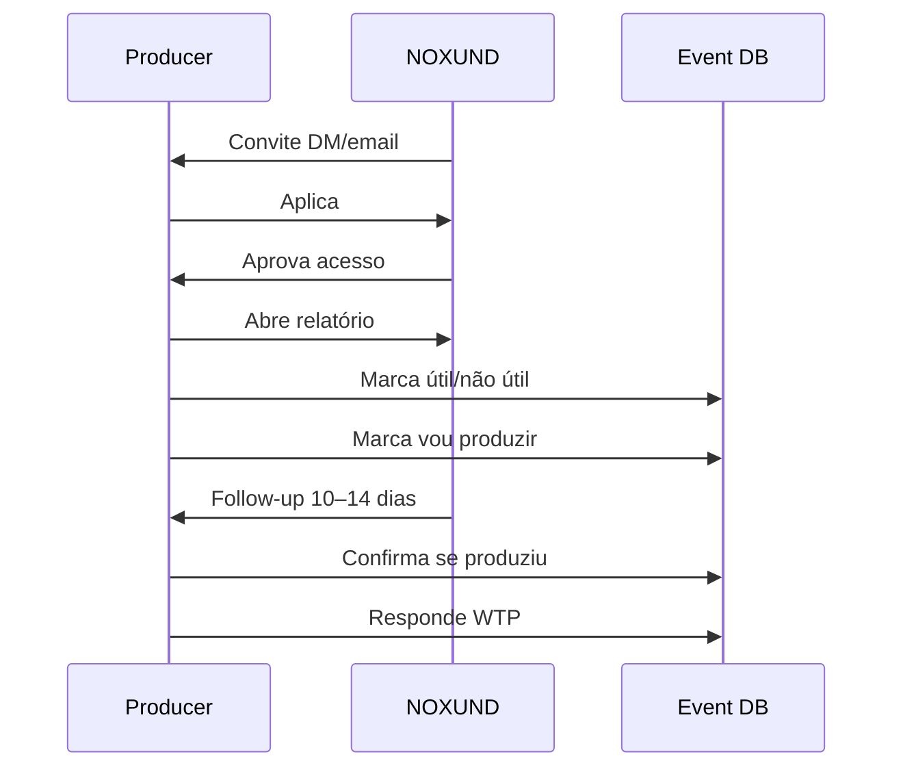

# 05 · Marketing, GTM & Validation Plan

**Objetivo:** definir como atrair produtores certos, validar o MVP e proteger o posicionamento da NOXUND.

---

## 1. Posicionamento

### Headline
> Market intelligence engine for producers.

### Subheadline
> See what's working, stay in the scene.

### Tese externa
A NOXUND ajuda produtores de type beat a ver quais artistas estão ganhando tração recente em uma cena específica, antes de entrar tarde demais.

### Tese interna
Hotspot Artists é o “cavalo de Troia” correto: entra como ferramenta independente, gera valor single-player e depois abre caminho para marketplace curado.

---

## 2. Promessa permitida

A NOXUND pode prometer:

- sinais recentes de mercado;
- leitura estruturada do YouTube;
- prova clicável;
- ranking de oportunidade;
- competição por canais distintos;
- foco em uma cena específica.

A NOXUND não pode prometer:

- previsão de viralização;
- garantia de venda;
- garantia de views;
- “IA que sabe o futuro”;
- nova análise em tempo real no MVP;
- substituição completa da intuição do produtor.

---

## 3. Público-alvo de marketing

### Primário
Produtores de Chicago Drill/Drill type beat que já publicam no YouTube.

### Secundário futuro
- produtores de Jersey Drill/Jersey Club;
- produtores de pluggnb/dark plugg;
- produtores com múltiplos canais de type beat;
- educadores/canais de beat selling.

### Não abordar agora
- rappers compradores de beat;
- labels;
- A&Rs;
- produtores sem canal;
- produtores generalistas sem nicho.

---

## 4. Estratégia de aquisição

### Lista inicial
Construir lista de 100 produtores com:

- nome;
- canal YouTube;
- email se disponível;
- Instagram/Twitter;
- nicho aparente;
- evidência de atividade recente;
- nota de fit.

### Ondas

| Onda | Volume | Objetivo |
|---|---:|---|
| Wave 1 | 40–60 convites | gerar 20–30 aplicações/aprovações potenciais |
| Wave 2 | restante da lista | repor baixo retorno ou baixa qualidade |
| Wave 3 | somente se necessário | completar N mínimo |

---

## 5. Canal primário: DM de artista

### Motivo
A cena vive em DM. Abordagem via conta de artista reduz cara institucional e aumenta naturalidade.

### Tom
- direto;
- respeitoso;
- sem hype;
- sem parecer venda;
- sem pedir demo;
- sem parecer spam de SaaS.

### Mensagem base
```text
Yo, quick one — I’m testing a private market report for type beat producers.

It looks at recent YouTube signals around Chicago Drill type beats and ranks artists that might be worth producing for right now.

It’s not public yet. I’m only inviting a few active producers to see if the data actually helps them decide what to make next.

Want me to send access?
```

### Variação mais curta
```text
Yo, I’m testing a private Chicago Drill type beat report for producers.

It shows artists with recent traction + competition signals from YouTube.

I’m inviting a few active producers to see if it actually helps them decide what to make next. Want access?
```

---

## 6. Canal secundário: email

### Assunto
`Private Chicago Drill report for type beat producers`

### Corpo
```text
Hey [Name],

I’m building NOXUND Hotspot Artists — a private market intelligence report for type beat producers.

The first test is focused only on Chicago Drill. It analyzes recent YouTube signals and shows artists that may be worth producing for right now, with proof links and competition indicators.

I’m not opening it publicly yet. I’m inviting a small group of active producers to test whether the report actually changes what they decide to make next.

Want access?

— [Name]
```

---

## 7. Landing/apply page

### Objetivo
Converter convite em aplicação qualificada.

### Estrutura
1. Hero com headline e subheadline.
2. Explicação curta: sinais recentes, YouTube, Chicago Drill.
3. O que o relatório mostra.
4. Critério de acesso fechado.
5. Formulário.
6. Nota de honestidade: “This first beta uses fixed report snapshots, not real-time generation.”

### CTA
- `Request Access`
- `Apply for Access`

### Não usar
- `Generate artists now`
- `Find viral artists with AI`
- `Get guaranteed sales`

---

## 8. Onboarding pós-aprovação

### Email/DM de aprovação
```text
You’re in.

Here’s your private access to the first NOXUND Hotspot Artists Report for Chicago Drill.

Use it like this:
1. Check the HOT artists first.
2. Open the YouTube example if you want proof behind the signal.
3. Mark any artist you’d actually produce for.

In 10–14 days I’ll ask whether you ended up making anything from it — that’s the main thing I’m testing.
```

---

## 9. Loop de validação

### Fluxo


---

## 10. Métricas de marketing e produto

### Topo de funil
- respostas por DM;
- taxa de aplicação;
- taxa de aprovação;
- taxa de abertura do relatório.

### Produto
- artistas marcados como úteis;
- artistas marcados como `vou produzir`;
- cliques nos Examples;
- alternância entre Relatório 1 e 2;
- tempo até primeira ação.

### Validação
- intenção declarada ≥ 30%;
- confirmação real ≥ 50%;
- WTP sim ≥ 25%;
- utilidade HOT ≥ 60%.

---

## 11. Conteúdo público permitido

Durante o MVP, conteúdo público deve construir autoridade sem abrir o produto.

### Formatos
- “What we learned from 500 Chicago Drill type beat videos”
- “Why artist choice matters more than another melody pack”
- “Type beat producers are competing on the wrong artists”
- “Recent traction vs saturated artists: how producers should think”

### Regra
Publicar insights agregados, nunca entregar a lista completa dos artistas do relatório.

---

## 12. Comunidades

Canais possíveis:

- Discords de produtores;
- comunidades de beat selling;
- Twitter/X de produtores;
- Reddit de produção musical;
- canais educacionais de type beat.

### Como entrar
Não entrar vendendo. Entrar publicando aprendizados sobre metodologia, descoberta e competição.

---

## 13. Parcerias futuras

Depois da validação:

- educadores de beat selling;
- produtores com canais fortes;
- newsletters de produtores;
- canais de YouTube sobre type beats;
- comunidades fechadas de produtores.

---

## 14. Narrativas a evitar

Evitar:

- “BeatStars killer”;
- “AI will replace your research”;
- “Find guaranteed buyers”;
- “Secret artists before everyone else”;
- “Marketplace for everyone”.

A narrativa correta:

> “A smarter way to decide who to produce for.”

---

## 15. Critério de leitura dos resultados

### Se intenção é alta e follow-up é alto
Produto validado. Avançar para Fase 2.

### Se intenção é alta e follow-up é baixo
Relatório é interessante, mas não muda comportamento. Revisar qualidade da oportunidade e follow-up.

### Se intenção é baixa e feedback é positivo
Produto é “legal”, mas não urgente. Revisar ICP/copy/tabela.

### Se WTP é baixo e comportamento é alto
Pode existir valor, mas monetização precisa ser indireta ou posterior.

### Se produtores não abrem o relatório
Problema de convite, posicionamento ou credibilidade antes do produto.

