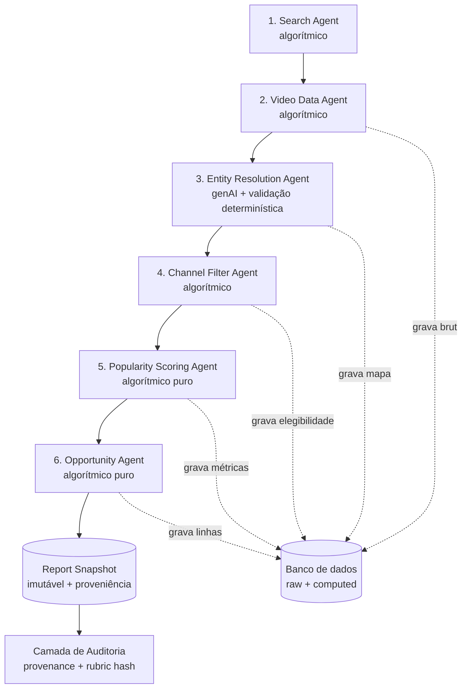

# NOXUND · Hotspot Artists Report — Arquitetura de Agentes & Briefing ao Product Lead

**Autor:** AI Systems Architect
**Versão:** 1.0 — Junho de 2026
**Base:** `MVP Spec v1.0` (vertical Chicago Drill, keyword travada `"chicago drill type beat"`)
**Escopo deste documento:** transformar a visão do produto em arquitetura de agentes executável, e alinhar o Product Lead sobre valor, escopo e cortes de metodologia.

---

## Parte A — Arquitetura de Agentes

### A.0 Princípio diretor (lê-se antes de tudo)

> **A IA generativa nunca produz, julga ou exibe um número.**
> Todo valor mostrado ao produtor (Score, Velocity, Signals, Competition, Example) é uma **função determinística** de dados brutos da YouTube Data API, armazenados de forma imutável e versionados por rubric. A camada generativa existe apenas para tarefas de **texto não-decisório** e sempre passa por validação algorítmica antes de qualquer uso.

Esse princípio existe porque o único ativo defensável do produto é a credibilidade analítica (a própria spec diz isso na Seção 6). Se um produtor — que olha métricas de YouTube todo dia — perceber que um número foi "inventado" por um modelo, o produto morre. Por isso a arquitetura separa rigidamente duas zonas:

| Zona | O que faz | Pode alucinar? | Aparece para o usuário? |
|---|---|---|---|
| **Zona determinística** | coleta, contagem, cálculo, ranking, seleção de exemplo | Não (é aritmética sobre dado bruto) | Sim — é o relatório inteiro |
| **Zona generativa** | extração de nome de artista do título, triagem de spam ambíguo, rascunho de copy | Sim (por isso é blindada) | Nunca como número; só como rótulo validado |

### A.1 Visão do pipeline



No MVP os agentes **1–2 rodam automatizados** (coleta) e **3–6 rodam como código + curadoria humana**. Recomendação de arquitetura: mesmo no MVP, **a aritmética dos agentes 5 e 6 deve ser executada por código, não à mão**. O humano cura casos de borda (ex.: artista duvidoso, vídeo-prova ofensivo), não recalcula o Score. Calcular Score manualmente reintroduz exatamente a arbitrariedade que a Seção 5.3 da spec tenta eliminar — e quebra a comparabilidade entre os dois relatórios.

### A.2 Catálogo de agentes

Para cada agente: **entrada → saída**, ferramentas, tipo, e o que ele grava para auditoria.

---

#### Agente 1 — Search Agent
- **Tipo:** algorítmico (sem IA).
- **Entrada:** keyword travada `"chicago drill type beat"`, janela `publishedAfter = now − 30d`, alvo de ~500 vídeos.
- **Saída:** lista de `video_id` + snippet mínimo (título, channelId, publishedAt).
- **Ferramentas:** YouTube Data API v3 → `search.list` (com paginação por `pageToken`).
- **Audita:** `run_id`, query exata, janela temporal, número de páginas, total coletado, timestamp da coleta.
- **Anti-alucinação:** não há texto gerado; a fonte é a resposta crua da API, armazenada verbatim.

#### Agente 2 — Video Data Agent
- **Tipo:** algorítmico.
- **Entrada:** lista de `video_id` do Agente 1.
- **Saída:** registro normalizado por vídeo — `views, likes, comments, publishedAt, title, channelId`.
- **Ferramentas:** `videos.list` (parts `statistics,snippet`), em lotes de 50 IDs.
- **Audita:** payload bruto por vídeo + timestamp de fetch (a "verdade de chão" de todo cálculo posterior).
- **Anti-alucinação:** o registro bruto é imutável. Nenhum agente posterior reescreve `views`/`likes`; só lê.

#### Agente 3 — Entity Resolution Agent  ← **único ponto de IA generativa no MVP**
- **Tipo:** híbrido — genAI **assiste**, regra determinística **decide**.
- **Entrada:** título do vídeo (ex.: `"Kairo Vee Type Beat [prod. ...]"`).
- **Saída:** `artist_name` canônico + `confidence` + `raw_title` preservado.
- **Ferramentas:** (1) regex de padrão `"<artista> type beat"` como primeira tentativa; (2) LLM apenas quando o regex falha ou é ambíguo, com prompt restrito ("extraia o nome do artista deste título; se não houver um artista identificável, responda `UNKNOWN`; não invente").
- **Guardrails obrigatórios:**
  - O LLM **não pode** retornar um nome que não seja substring/normalização plausível do título — validação determinística pós-resposta rejeita qualquer nome ausente do texto-fonte.
  - `confidence < limiar` → vai para **fila de revisão humana**, não entra no relatório automaticamente.
  - O `raw_title` original é sempre guardado; o nome canônico é metadado, não substitui a evidência.
- **Audita:** título-fonte, método usado (regex vs LLM), confidence, e se houve override humano.
- **Por que IA aqui e em nenhum outro lugar:** parsing de texto livre é a única tarefa do pipeline onde linguagem natural realmente ajuda e onde regra pura erra em variações de nomenclatura. É também a maior superfície de alucinação — por isso é a mais blindada.

#### Agente 4 — Channel Filter Agent
- **Tipo:** algorítmico.
- **Entrada:** `channelId` dos vídeos + mapa vídeo→artista do Agente 3.
- **Saída:** flag de elegibilidade por canal (não-spam, histórico mínimo de uploads públicos) **e** contagem de **canais distintos por artista** (insumo direto da coluna Competition).
- **Ferramentas:** `channels.list` (statistics) + regra de elegibilidade (mín. de uploads públicos, idade do canal, ausência de padrão de spam).
- **Audita:** decisão de elegibilidade por canal + critério aplicado + contagem de canais distintos por artista.
- **Anti-alucinação:** spam é decidido por **heurística numérica** (contagem de uploads, recência, repetição), não por "achismo" de modelo. Casos ambíguos → fila de revisão, nunca classificação silenciosa por LLM.

#### Agente 5 — Popularity Scoring Agent
- **Tipo:** algorítmico **puro** (zero IA).
- **Entrada:** vídeos elegíveis agrupados por artista (saída de 2+3+4).
- **Saída:** por artista — `velocity`, `signals`, `engagement`, `channel_diversity` e o **Score 0–100** segundo o rubric travado da Seção 5.3.
- **Ferramentas:** código de cálculo + a distribuição da amostra de 500 vídeos para normalização. Fórmulas exatas no documento de handoff técnico (Parte de cálculo de métricas).
- **Audita:** valor de cada componente, valores normalizados, pesos, **hash da versão do rubric** e os `video_id` que entraram em cada métrica.
- **Anti-alucinação:** Score é reproduzível — rodar de novo sobre o mesmo snapshot tem que dar **exatamente o mesmo número**. É o teste de regressão da credibilidade.

#### Agente 6 — Opportunity Agent
- **Tipo:** algorítmico puro.
- **Entrada:** artistas com Score + métricas (saída do Agente 5).
- **Saída:** ranking final; **Tag HOT** (Score > 90); **Competition** (Low/Medium/High por canais distintos, Seção 5.6); **Example** (regra determinística da Seção 5.7); Score exibido só se > 83.
- **Ferramentas:** ordenação + thresholds + regra de seleção de vídeo-prova.
- **Audita:** posição no ranking, motivo da tag HOT, nível de Competition + contagem que o justifica, `video_id` escolhido como Example + por que (maior velocity → mais recente → mais views).
- **Anti-alucinação:** a seleção do Example é **determinística e idêntica nos dois relatórios** — elimina a aparência de arbitrariedade que a Seção 5.7 sinaliza.

### A.3 Onde entra IA generativa (e onde **não** entra)

**Entra (MVP):**
- Apenas no **Agente 3**, para extrair nome de artista de títulos ambíguos — e sempre sob validação determinística + fila de revisão para baixa confiança.

**Entra (Fase 2, opcional):**
- **Copy Agent** para rascunhar microcopy/tooltip e variações de mensagem de follow-up. Nunca toca número, nunca gera "insight" analítico exibido como fato.

**Nunca entra:**
- Cálculo de Score, Velocity, Signals, Competition.
- Ranking de oportunidade.
- Seleção do vídeo-prova.
- Qualquer "comentário de IA" sobre o artista no relatório (sem metodologia para validar = risco de alucinação puro).

### A.4 Onde entra regra algorítmica

Praticamente todo o pipeline: busca, coleta, elegibilidade de canal, contagem de canais distintos, todas as quatro componentes do Score, normalização, ranking, thresholds de Competition e seleção determinística de Example. **Regra algorítmica é o default; IA generativa é a exceção justificada.**

### A.5 Onde entra o banco de dados

Três camadas de persistência (schema detalhado no handoff técnico):

1. **Raw / fonte da verdade** — respostas cruas da API por vídeo e canal, com timestamp de fetch. **Imutável.** Nada reescreve.
2. **Computed / derivado** — métricas por artista, Score, nível de Competition, linhas do relatório. Sempre reconstruível a partir do raw.
3. **Snapshot de relatório** — versão congelada (os "Relatório 1 de 2") com referência ao `run_id` e ao hash do rubric que o produziu.

Regra de ouro: **derivado é descartável, raw é sagrado.** Se a fórmula mudar, reprocessa-se o derivado a partir do raw — sem nunca recoletar nem "ajustar" números à mão.

### A.6 Onde entra auditoria / proveniência

Cada célula do relatório carrega rastro:

- **Score** → componentes, valores normalizados, pesos, versão do rubric, `video_id` usados.
- **Competition** → contagem de canais distintos + lista de `channel_id`.
- **Velocity** → vídeos e mediana que a geraram.
- **Example** → `video_id` + a regra que o selecionou.
- **Artist name** → título-fonte + método (regex/LLM/humano) + confidence.

Isso serve a três objetivos: (1) **defender o número** se um produtor questionar; (2) garantir **consistência entre os dois relatórios** (mesmo rubric, mesma regra); (3) permitir o **teste de reprodutibilidade** — reprocessar o snapshot tem que regenerar o relatório idêntico.

### A.7 Estratégia anti-alucinação (consolidada)

1. **Separação de zonas** — número = determinístico; texto = generativo e validado. Inegociável.
2. **Fonte da verdade imutável** — todo número deriva de raw armazenado, não de memória de modelo.
3. **Reprodutibilidade** — mesmo snapshot ⇒ mesmo output. É teste automatizável.
4. **Validação pós-LLM** — saída do Agente 3 rejeitada se o nome não existir no título-fonte.
5. **Fila de revisão humana** — baixa confiança nunca entra silenciosamente.
6. **Rubric versionado por hash** — comparabilidade entre relatórios é verificável, não confiável "no olho".
7. **Sem insight gerado** — o produto não afirma nada que não consiga rastrear até um `video_id`.

### A.8 MVP vs Fase 2 (o que automatiza depois)

- **MVP:** Agentes 1–2 automatizados; 3–6 como código + curadoria humana de borda; dois snapshots fixos; Retry rotulado honestamente ("Ver outro grupo de oportunidades", sem implicar geração ao vivo).
- **Fase 2:** orquestração ponta a ponta dos 6 agentes; multi-keyword/multi-nicho via fan-out; Retry pode então gerar de fato um novo corte sob demanda — porque aí existirá pipeline real por trás.

---

## Parte B — Briefing ao Product Lead

Linguagem direta, sem jargão de arquitetura. Seis perguntas, seis respostas.

### B.1 Qual problema do produtor será resolvido

O produtor de type beat decide para quem produzir **por intuição, feed e tendência percebida** — e descobre tarde demais que entrou num artista já saturado ou que ignorou um que estava bombando. O problema real não é "falta de dados no YouTube" (o dado está lá, público). É **falta de leitura estruturada e confiável desse dado no momento da decisão de produção.** O Hotspot resolve a pergunta "para quem vale a pena produzir esta semana, e isso ainda dá tempo?".

### B.2 Qual promessa o agente pode fazer

**Pode prometer:** "Estes são os artistas com tração recente real (últimos 30 dias) no Chicago Drill, ranqueados por sinais que você pode verificar, com um indicador de quão concorrida já está a oportunidade." Toda palavra dessa promessa é sustentável por dado rastreável.

**Não pode prometer** (e o produto não deve insinuar): previsão de que o artista "vai estourar", garantia de retorno, ou "análise de IA em tempo real". A promessa é de **inteligência de sinais recentes**, não de futurologia nem de mágica de modelo. Vender além disso destrói a credibilidade — que é o único ativo defensável.

### B.3 Qual output é útil

Útil = **acionável + verificável + honesto sobre seus limites.** A tabela entrega isso quando cada linha permite ao produtor decidir em segundos:

- **Tag HOT** → onde olhar primeiro.
- **Score** → quão forte é o sinal recente (com tooltip dizendo que é performance recente, não histórico completo).
- **Velocity / Signals** → o "porquê" por trás do Score.
- **Competition** → se ainda dá tempo de entrar.
- **Example** → a prova clicável de que não é lista inventada.

O que **não** é útil e foi cortado: gráfico extra, narrativa gerada, ou um número sem o vídeo-prova que o sustenta.

### B.4 Qual fluxo gera valor real

```
Convite (DM de artista) → Aplicação curta → Validação manual →
Acesso ao relatório fechado → Produtor marca "vou produzir para X" →
Follow-up em 10–14 dias ("produziu? publicou? como foi?") →
Confirmação de produção real → Sinal de WTP
```

O valor de produto só é provado no trecho **intenção → confirmação real**. Intenção declarada infla fácil (dizer é mais barato que fazer). O loop de follow-up é o que separa "relatório interessante" de "relatório que muda comportamento" — que é literalmente a hipótese central da Seção 1.2. **Sem o follow-up, a validação não vale.**

### B.5 Qual feature entra no MVP

- Coleta automatizada de ~500 vídeos (keyword travada, janela 30d).
- Dois relatórios fixos, 10 artistas cada, 2 HOT por relatório.
- Tabela com as 6 colunas, Score por rubric travado, Competition redefinida (canais distintos), Example determinístico.
- Botão Retry rotulado com honestidade ("Ver outro grupo de oportunidades").
- Feedback binário por artista, registro de intenção, follow-up automático e pergunta única de WTP.
- Acesso fechado com aprovação manual.

### B.6 O que deve ser removido por falta de metodologia

Como AI Systems Architect, sinalizo para remoção/restrição:

1. **Qualquer cálculo de número feito "no olho" ou por IA generativa.** Score, Velocity e Competition têm que sair de código sobre dado bruto. Calcular à mão entre os dois relatórios = arbitrariedade comparável lado a lado (Seção 5.3).
2. **A simulação de "nova análise de IA" no Retry.** Resultado estático com cara de processamento ao vivo é a inconsistência mais provável de ser percebida pelo público-alvo (Seção 6). Mantém-se a função; remove-se o enquadramento enganoso.
3. **Seleção subjetiva do vídeo-prova** ("melhor combinação de velocity, relevância, canal e recência"). Substituída por regra determinística (Seção 5.7) — senão os dois relatórios parecem inconsistentes.
4. **Competition duplicando Signals.** Já corrigido na spec (canais distintos vs nº de vídeos); a arquitetura reforça que são dois cálculos diferentes sobre dados diferentes.
5. **Qualquer "insight" textual gerado por IA sobre o artista.** Não há metodologia para validá-lo e é 100% superfície de alucinação. Fora do MVP, sem exceção.

> **Resumo para o Product Lead:** o produto vende confiança. A arquitetura inteira existe para que cada número da tela seja defensável até a fonte. Tudo que não passar nesse teste — número sem rastro, IA gerando análise, animação que finge processar — sai do MVP, porque o custo de ser pego "inventando" é a morte do único diferencial que temos.
