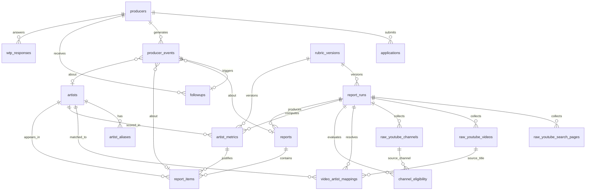

# Entity-Relationship Notes — NOXUND MVP

**Status:** proposta. Acompanha `mvp-data-model.md`. Não é DDL.
Foco: relações, classes de imutabilidade e **cadeias de proveniência** (raw → computed → snapshot).

---

## 1. Diagrama ER (proposta)

Refina o ER de `04_...` §2 com `audit_events`, `artist_metric_id` em `report_items` e o split opcional de runs (OD-DB-01, tracejado).



`audit_events` é polimórfica (`entity_table` + `entity_id`) e por isso não aparece com FK rígida no diagrama; ela referencia logicamente `applications`, `reports`, `artists`, `video_artist_mappings`, `producers`.

---

## 2. Classes de imutabilidade

| Classe | Regra operacional | Tabelas |
|---|---|---|
| **RAW** | Insert-only. Sem `UPDATE`/`DELETE`. Recoleta = novo `run_id`. | `raw_youtube_search_pages`, `raw_youtube_videos`, `raw_youtube_channels` |
| **COMPUTED** | Reconstruível por `run_id` + `rubric_hash`/`rule_version`. Recompute apaga+recria; nunca edição manual de número. | `video_artist_mappings`, `channel_eligibility`, `artist_metrics` |
| **SNAPSHOT** | Congelado após `reports.status = published`. Valores copiados, não derivados em leitura. | `reports` (pós-publish), `report_items` |
| **EVENT** | Append-only. Estado é agregação de eventos; correção = evento compensatório. | `producer_events`, `audit_events`, `artist_aliases`, `wtp_responses` |
| **STATE** | Só colunas de status mutáveis, via máquina de estados; transição sensível → `audit_events`. | `producers`, `applications`, `followups`, `report_runs`, `artists` |

### O que entra em RAW
Tudo que vem verbatim da YouTube Data API: páginas de busca (`response_json`), vídeos (`raw_json`, views/likes/comments/title/published_at), canais (`raw_json`, uploads/subs/views). Timestamp de coleta. **Nada derivado.**

### O que entra em COMPUTED
Derivações determinísticas do raw: mapeamento vídeo→artista, elegibilidade de canal, métricas e Score (componentes 40/25/20/15, velocity mediana, signals, diversidade de canais), `raw_score`/`final_score`. Sempre carregando `rubric_version` + `rubric_hash` + `computed_from_video_ids`.

### O que entra em REPORT SNAPSHOT
Os valores **congelados** que o produtor vê: `score_display`, `score_value`, `signals`, `velocity_display`, `competition_level`, `competition_channel_count`, `example_video_id`/`example_url`, `tag` (HOT) e a prova (`selection_reason_json`). Materializados no publish.

### O que pode ser recalculado
Toda a classe COMPUTED. Dado o mesmo snapshot raw e o mesmo `rubric_hash`, o pipeline deve reproduzir métricas idênticas (`03_...` §12). `report_items` derivam do computed no momento do publish e então **congelam**.

### O que nunca deve ser sobrescrito
- Qualquer linha RAW.
- Qualquer `report_items`/`reports` após `published`.
- Qualquer linha EVENT (`producer_events`, `audit_events`).
- `rubric_versions`/`outcome_weight_versions` publicadas (nova versão = nova linha).

---

## 3. Cadeias de proveniência

### 3.1 Número público → raw (requisito #15 e `04_...` §14)
Todo valor exibido resolve até o raw:

```txt
report_items.score_value / signals / velocity_display / competition_channel_count
  └─ report_items.artist_metric_id  ──►  artist_metrics
        ├─ rubric_version + rubric_hash  ──►  rubric_versions
        └─ computed_from_video_ids[]      ──►  raw_youtube_videos (run_id, video_id)
                                                  └─►  raw_youtube_search_pages (run_id)
```

### 3.2 Example → raw
```txt
report_items.example_video_id  ──►  raw_youtube_videos (run_id, video_id)
report_items.selection_reason_json  ──►  prova da regra determinística
     (candidatos elegíveis → top-3 velocity → mais recente → desempate por views)  (03_... §8, §10)
```

### 3.3 Competition → raw
```txt
report_items.competition_level / competition_channel_count
  └─ artist_metrics.channel_diversity_count
        └─ channel_eligibility (run_id, channel_id, is_eligible, rule_version)
              └─ raw_youtube_channels (run_id, channel_id)
```
Regra de não-duplicação: **canais distintos elegíveis → Competition; vídeos válidos → Signals** (`03_...` §6).

### 3.4 Artist name → título-fonte (guardrail de IA)
```txt
report_items.title (Artist Type Beat)
  └─ artists.canonical_name  ◄─ artist_aliases (source)
  └─ video_artist_mappings (extracted_name, method, needs_review)
        └─ raw_youtube_videos.title   (extracted_name DEVE ser substring/normalização do title)
```

### 3.5 Outcome de validação → evento (sem flags)
```txt
producer_events (intent_to_produce_declared)
  └─ followups (producer_event_id, due_at = intenção + 10–14d)
        └─ producer_events (followup_sent → followup_confirmed_produced|not_produced)
```
Nenhuma coluna booleana de estado; tudo é série de eventos (`04_...` §8, §13).

### 3.6 Ação humana → auditoria
```txt
audit_events (action, actor_id, entity_table, entity_id, before_json, after_json, reason)
   ◄─ application.approved | report.published | mapping.human_override | producers.status change
```

---

## 4. Reconstrução de um relatório (teste de aceite)

Critério (`04_...` §14, `03_...` §12): um relatório é reconstruível a partir de `run_id` + `rubric_version`.

```txt
run_id ─► raw_youtube_* (imutável)
        ─► [recompute] video_artist_mappings, channel_eligibility, artist_metrics
              usando rubric_versions[rubric_hash]
        ─► [rebuild] report_items determinísticos
        ─► comparar com o report_items congelado  →  devem ser idênticos nas células computadas
```

Se diferir, é bug metodológico (não "ajuste no olho"). Isto é o que torna o split de runs (OD-DB-01) atraente: `scoring_run` permite reprocessar o mesmo `collection_run` sob novo `rubric_hash` sem tocar o raw.

---

## 5. Índices e constraints sugeridos (indicativo, não DDL)

- **Unicidade lógica RAW:** `(run_id, video_id)` em `raw_youtube_videos`; `(run_id, channel_id)` em `raw_youtube_channels`.
- **Idempotência acesso:** `lower(email)` único em `producers`; índice parcial p/ no máx. 1 aplicação aberta por produtor.
- **Computed:** `(run_id, artist_id)` único em `artist_metrics`; `(run_id, channel_id)` único em `channel_eligibility`.
- **Eventos:** índices em `producer_events(producer_id, event_type, created_at)` p/ as queries de `04_...` §13.
- **Follow-up cron:** índice em `followups(status, due_at)`.
- **Sem FK que permita órfão de snapshot:** `report_items.report_id` e `report_items.artist_metric_id` `ON DELETE RESTRICT` (snapshot não deve perder proveniência).
- **Proibir update em RAW:** garantir por RLS/trigger/grants (sem rota de UPDATE) — detalhe em `rls-review-notes.md`.

---

## 6. Anti-padrões barrados pelo modelo

- ❌ `producers.has_intent boolean` / `produced boolean` → usar `producer_events`.
- ❌ `UPDATE raw_youtube_videos SET views = ...` → recoletar com novo `run_id`.
- ❌ recomputar Score na leitura do report → valores congelados em `report_items`.
- ❌ editar Score manualmente em `artist_metrics` → só recompute determinístico.
- ❌ criar `beats`/`orders`/`payouts`/`licenses`/`carts`/... → Fase 2 (`04_...` §12).
- ❌ número no `report_items` sem `artist_metric_id`/`computed_from_video_ids` → quebra auditoria.
